# AILA — Architecture Reference

AILA (product name for the codebase historically called *LexChat*) is a family of AI
legal-research assistants for a UK government organisation. This document is the architectural
reference: it presents the system through a series of complementary **views**, each with a Mermaid
diagram.

For narrative product detail see [SPECIFICATION.md](SPECIFICATION.md); for low-level schema/flow
detail see [DESIGN.md](DESIGN.md); for the authoritative endpoint list see
[api/ServerAPISpec.md](api/ServerAPISpec.md); for firewall/allowlist detail see
[NETWORK_AND_DEPENDENCIES.md](NETWORK_AND_DEPENDENCIES.md).

> **Guiding principle: one codebase, many bots.** There is a single backend (`server_py/`) and a
> single frontend (`client/`). Every bot — the legislation assistant, the Scottish Parliament
> (Holyrood) bot, the Westminster bot, and any future bot — runs the *same* `uvicorn src.main:app`,
> differentiated by **configuration, not forked code**.

**The fleet as built:** legislation (`legislation_only`), Holyrood parliament
(`parliamentary_records`) and Westminster (`westminster_records`) are live. A legislative-drafting
bot (`drafting`) is in build on the long-lived `feature/drafting-bot` branch and is deliberately
*not* on `main` — see [drafting/BUILD_PLAN.md](drafting/BUILD_PLAN.md).

---

## 1. System context

Who and what the system talks to. The organisation runs one or more **bot processes**; each serves
qualified-lawyer users and reaches out to LLM providers and research APIs. Bots can consult each
other via federation.

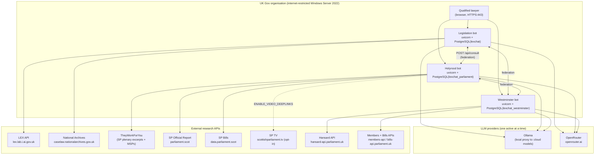

**Notes**
- The target is *internet-restricted* (whitelist-only outbound), not air-gapped. Each external host
  above must be whitelisted for the corresponding bot — see [NETWORK_AND_DEPENDENCIES.md](NETWORK_AND_DEPENDENCIES.md).
- The Holyrood bot is **Scotland-only**; Westminster/Hansard coverage moved to its own bot rather
  than back into the Holyrood toolset.
- `ENABLE_WESTMINSTER_VIDEO_DEEPLINKS` / `PLIVE_BASE_URL` exist as settings, but parliamentlive.tv
  deep links are **not implemented** — see [parliament/WESTMINSTER_VIDEO_IMPLEMENTATION_PLAN.md](parliament/WESTMINSTER_VIDEO_IMPLEMENTATION_PLAN.md).

---

## 2. Container / component view (a single bot process)

One uvicorn process serves both the pre-built React UI (static files) and the `/api` backend. The
agent pipeline is provider-agnostic: a `ContextVar` carries the resolved provider config through the
whole async call chain.

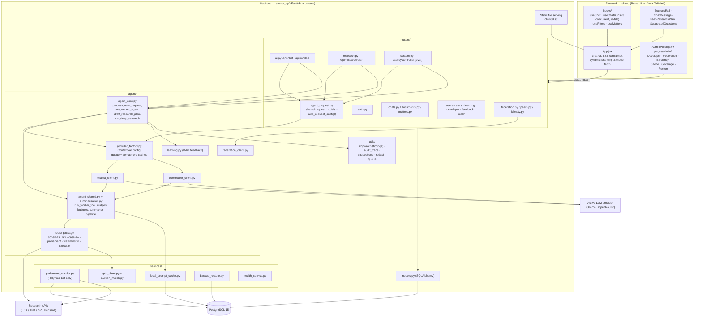

**Key design points**
- **Provider abstraction** — `ollama_client.py` and `openrouter_client.py` each implement the same
  ReAct `chat_loop`; `agent_shared.py` + `summarisation.py` hold the shared tool-execution and
  summarisation pipeline. The active provider is resolved per request from the `app_settings` table
  and carried by a `ContextVar` — no function signatures change when the provider switches.
- **One request-config seam** — `routers/agent_request.py` defines `AgentRequestBase` → `ChatRequest`
  → `SystemChatRequest` (a *subclass*, so a field added to `/api/chat` is accepted by the eval
  endpoint automatically) plus the single `build_request_config()` all three entry routers use.
  Duplicating that config block is what previously caused `/api/system/chat` to silently drop
  `chat_mode`, filters and Deep Research.
- **Per-provider concurrency** — a `RequestQueue` (`max_concurrent_requests`) and a summarisation
  `asyncio.Semaphore` (`max_summarise_concurrency`) are cached per `(provider, concurrency)` and
  recreated automatically when settings change.
- **No global auth middleware** — every protected route declares `Depends(get_current_user)`
  explicitly. Public routes: `/api/auth/login`, `/api/health`, and the identity endpoints.
- **Log redaction** — user content and PII are redacted at INFO (`utils/redact.py` renders
  `<N chars, sha1:…, 'prefix…'>`) and appear in full only at DEBUG. `redact_args` is
  allowlist-based, so a new free-text tool parameter loses log fidelity rather than confidentiality.

---

## 3. One codebase, many bots

Behaviour is switched at runtime by configuration under `bots/<id>/`, not by branching code.

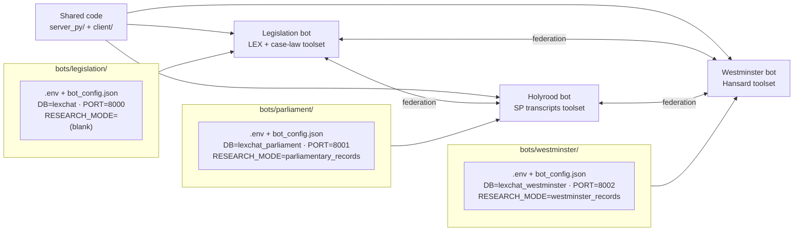

`RESEARCH_MODE` (env) → `research_mode` drives three things:

| Driven by mode | Where |
|---|---|
| Worker toolset | `tools/schemas.py::get_worker_tools(mode)` |
| Manager + Worker system prompts | `prompts.py::get_manager_system_prompt` / `get_worker_system_prompt` |
| Efficiency profile (breach rules + dashboard bands) | `config.py::EFFICIENCY_PROFILES` / `get_efficiency_profile()` |

Modes: `legislation_only`, `case_law_only`, `legislation_and_case_law`, `parliamentary_records`,
`westminster_records`. Each bot is an independent process with its **own database and port**;
identity (name, tagline, logo, brand colour) comes from `bot_config.json` and reaches the client via
`GET /api/bot-info` and `GET /api/bot/logo`, so one frontend bundle renders as any bot.

---

## 4. Request lifecycle — Manager / Worker (sequence)

The Manager handles conversation and delegates deep research to the Worker. The Manager streams
tokens to the browser over SSE; the Worker's intermediate reasoning is not streamed.

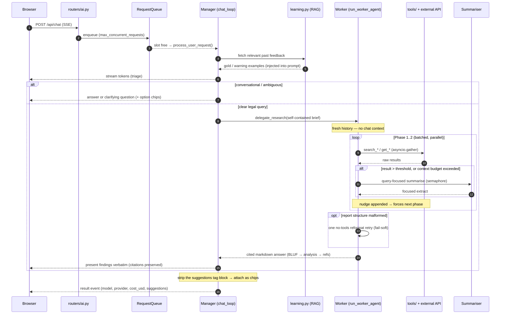

**Caps and resilience**
- `chat_loop` is capped at ~20 turns; tool results are hard-capped to `summarise_threshold + 4,000`
  chars *after* summarisation.
- **Summarisation threshold scales with the model** — 10% of the model's context in chars, clamped
  to [10K, 200K] (`get_summarise_threshold()`), so it is not a fixed 8K any more. Because that caps
  each result but never their *sum*, `run_worker_agent` also carries a per-run
  **`WORKER_CONTEXT_BUDGET_CHARS = 250_000`**: once the running total would exceed it, a result is
  summarised regardless of its own size.
- **Graceful failure in three layers** — a failed worker run returns an `[Research Agent Error]`
  *tool result* to the Manager rather than killing the SSE request; `describe_agent_error` gives
  every user-facing failure real text (httpx timeouts stringify to `""`); `/api/chat` wraps that in
  a "try again, or narrow the question" error event. Real user aborts still propagate.
- **Bounded retries** — the provider stream is retried up to 3 times, but **only while nothing has
  been emitted** (replaying would duplicate tokens); LEX calls retry `{429, 502, 503, 504}` with
  exponential backoff honouring `Retry-After`.
- **Suggested-question chips** — the model emits a tagged `<suggestions>` block; it is stripped and
  attached at the **Manager return in `agent_core.py`**, not in the router, because
  `process_user_request` also serves `/api/consult` — so a peer's chips can never leak into the
  calling bot's context. Live only: no DB column, gone after reload. Governed by the
  `suggested_questions_enabled` flag, which *substitutes the instruction out of the prompt* rather
  than overriding it (the strip stays unconditional as belt-and-braces).
- **Concurrent runs are in-tab only** — up to 3 per browser tab (`useChatRuns.js`); a refresh or tab
  close still destroys a run, because `/api/chat` never writes the assistant message itself. The
  durable design is deliberately deferred — see [CONCURRENT_RUNS_DURABILITY.md](CONCURRENT_RUNS_DURABILITY.md).

---

## 5. Worker research pipeline (legislation mode)

The Worker follows a prescribed multi-phase process. Discovery is deliberately slimmed and batched
so that Phase 1 rarely needs summarisation; Phase 2 does the real retrieval.

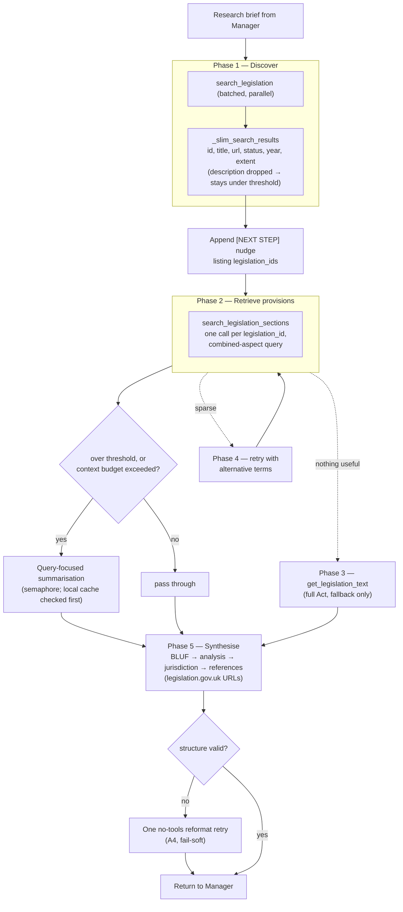

**Mode variants of the same discover → retrieve → synthesise shape:**

| Mode | Discovery | Retrieval | Notable enforcement |
|---|---|---|---|
| Legislation / case law | `search_legislation`, `search_case_law` | `search_legislation_sections`, `get_case_law_text`, `get_legislation_text` (fallback) | one call per `legislation_id`; appellate-decision detection nudges the Worker to the higher-court judgment |
| Holyrood (`parliamentary_records`) | `search_scottish_plenary` / `_committee_transcripts` (local FTS), `search_scottish_parliament` (excerpt fallback) | `get_scottish_plenary_debate` / `get_scottish_committee_transcript` (live fetch + parse) | hard **search budget of 3** discovery calls, enforced in `run_worker_tool`; retrieval capped at 150 speeches per item |
| Westminster (`westminster_records`) | `search_hansard` (live API; chamber / Westminster Hall / PBC / written) | `get_hansard_debate` (verbatim contributions) | same search-budget shape; contributions capped at 150 per debate |

Both parliamentary modes exist to answer *Pepper v Hart*-style questions — retrieving a Minister's
exact words on statutory purpose — which is why verbatim retrieval, not excerpts, is the goal and
why the transcript caps report `total_speeches` and tell the model to narrow rather than truncating
silently.

---

## 6. Deep Research (plan → approve → execute)

An opt-in `chat_mode = "deep_research"` that drafts an **editable** plan, lets the lawyer change it,
then executes it autonomously. Plan-first is what makes the run steerable and leaves an auditable
approved-plan artefact. **L2 only** — there is no pause-and-review between steps.

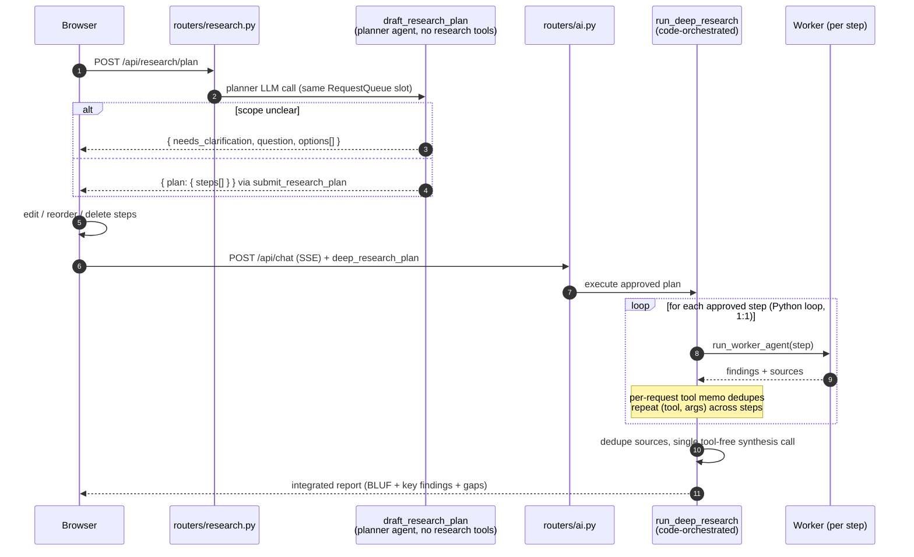

- **Code-orchestrated, not prompt-driven** — one `run_worker_agent` call per approved step gives a
  deterministic mapping between what was approved and what was done.
- **Audit column** — `messages.research_plan` (additive JSON) persists the approved plan on the
  assistant message and the UI renders it back.
- **Efficiency carve-out** — a DR run legitimately fans out to N delegations, so it is exempt from
  the fan-out breach rules and excluded from the Efficiency dashboard's baselines.
- Planner clarifications reuse the suggested-question chip render path, under the same
  no-speculation guardrail: only scope choices grounded in the conversation or in tool results.
- Build spec: [deep-research/IMPLEMENTATION_PLAN.md](deep-research/IMPLEMENTATION_PLAN.md).

---

## 7. Provider resolution & concurrency

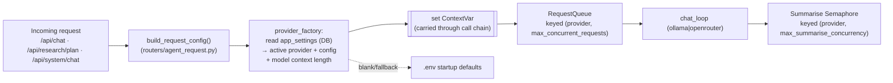

- `AppSetting(key="provider.ollama")` and `AppSetting(key="provider.openrouter")` store per-provider
  JSON blobs (`base_url`, `api_key`, `model`, `summarisation_model`, `temperature`, concurrency).
- A separate `summarisation_model` can be configured per provider so a fast/cheap model handles
  document summarisation while a capable model does reasoning.
- The resolved model's **context length** rides on the request config and sets the summarisation
  threshold (§4).
- Ollama summarisation concurrency should be **1** (concurrent calls to the cloud endpoint 500);
  OpenRouter tolerates 5+.
- **Model quality dominates**: a capable instruction-follower batches Phase 2 correctly and finishes
  an 8-Act query in ~90s; a weak model ignores batching and is ~10× worse on identical
  infrastructure.

---

## 8. Caching stack

Three cooperating cost-reduction layers, all additive and fail-soft, each behind a feature flag, all
reporting into Admin Portal → **Cache** (`GET /api/stats/cache`, backed by additive
`request_timings` columns).

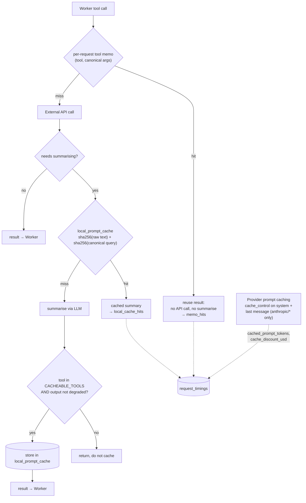

| Layer | Scope | Key | Flag |
|---|---|---|---|
| Provider prompt caching (D5) | one provider call | provider-side prefix | `prompt_caching_enabled` |
| Per-request tool memo (D5/D8) | one request (dies with it) | `(tool_name, canonical args JSON)` | `tool_memo_enabled` |
| Local prompt cache (D7/D8) | **cross-user, cross-provider**, persistent | `sha256(raw pre-summarisation text)` + `sha256(canonicalised query)` | `local_prompt_cache_enabled` |

**Why the local cache is safe to share:** identical hash ⇒ identical source text, so staleness is
impossible (amended text produces a new hash → a miss). It is **exact-match only, no embeddings** —
semantic near-miss reuse risks silent incompleteness. `summarise_model` is stored for provenance but
kept *out* of the key, which is what makes it cross-provider.

**Guardrails worth knowing before touching it**
- Only tools on the explicit `CACHEABLE_TOOLS` allowlist may be stored — the cache is shared across
  users, so a new tool must be confirmed public-source-only first.
- Degraded/partial summariser output (the raw-text fallback) is **never** stored; one transient
  error would otherwise poison a shared key permanently.
- The key query is the **raw user question** in standard mode (not the Manager's per-model
  paraphrase, which would make cross-user hits luck) and the approved step text in Deep Research.
- The cache is **forced off in code** for `research_mode == "drafting"`, in `build_request_config()`
  — a drafting bot's input is unpublished legislative text and must never reach a shared plaintext
  column. Consequence: a drafting bot's Cache tab shows "Local cache: ON". That is expected.
- Canonicalisation is versioned by a `v1|` hash prefix (bumping it invalidates the whole cache).
- **Not built:** a LEX/case-law response cache — measurement showed LLM time dominates external-API
  time ~16:1. Deferred until traffic says otherwise.
- Plans: [LOCAL_PROMPT_CACHE_PLAN.md](LOCAL_PROMPT_CACHE_PLAN.md),
  [CACHE_REVIEW_FIXES_PLAN.md](CACHE_REVIEW_FIXES_PLAN.md), [CACHE_ADMIN_UI_PLAN.md](CACHE_ADMIN_UI_PLAN.md).

---

## 9. Federation

When at least one enabled peer is registered, the Manager gains a `consult_peer` tool alongside
`delegate_research`. With zero peers the behaviour is identical to a single-bot deployment (the tool
is simply absent).

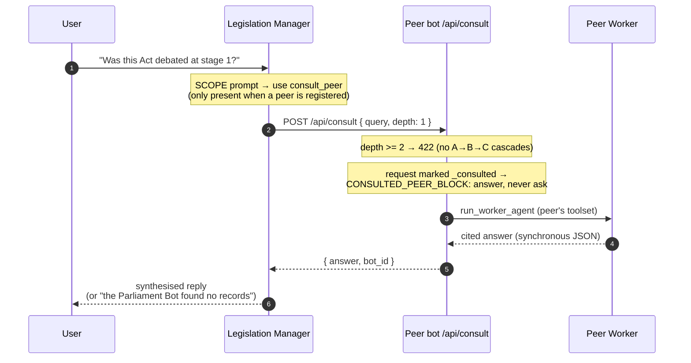

- Peer registry lives in the `peer_bots` table (Admin Portal → Federation tab, or `/api/peers`).
  `api_key` is **write-only** — never returned by any response. `PUT /api/peers/{peer_id}` takes the
  string peer id, not the numeric row id; the `bot_config.json` seed is insert-or-ignore and never
  updates an existing row.
- `/api/consult` is **synchronous JSON**, not SSE — the calling Manager blocks for the full answer.
- Manager prompts carry cross-bot SCOPE rules in both directions, and distinguish "the peer found no
  records" from "no parliamentary peer is registered" — the latter is the only case that may be
  reported as unavailable.
- A consulted peer **never asks the user anything**: the consult channel is one-shot and stateless,
  so a clarifying question would come back *as the answer*. The block is appended on all three
  return paths of `get_manager_system_prompt` (the parliament/Westminster branch returns early).

---

## 10. Parliamentary data pipelines

### Holyrood — crawl into local FTS, retrieve verbatim on demand

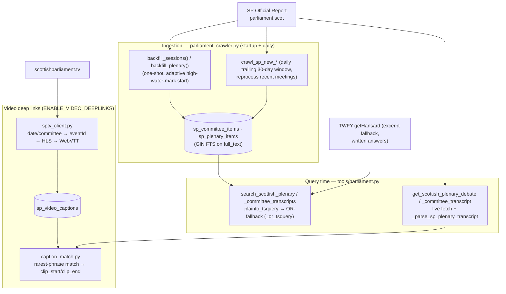

- **FTS, not embeddings** — a measured go/no-go gate found FTS-only sufficient (semantic retrieval is
  deferred/NO-GO). Two cheap wins shipped instead: an **OR-fallback** when `plainto_tsquery` (all
  terms AND-ed) returns zero rows, and **prompt-level query wording** (use the official Holyrood
  term, e.g. *unhoused → homeless*). Raw hit-rate ~85% → ~88%; residual misses recover on the
  single permitted reformulation retry.
- **Incremental crawl** — the source sends no `Last-Modified`/`ETag`, so change detection is driven
  by our own stored state: adaptive backfill start (full Session-6 walk only on an empty table) plus
  a trailing-window daily re-scan that reprocesses recent meetings, catching late-published
  transcripts. Not covered: revisions to finalised transcripts outside the 30-day window.
- **One parser for both** — committee pages now use the same `
` markup as
  plenary, so `_parse_sp_plenary_transcript` serves both the retrieval tools and the crawler.
- **Video timing** — segment ordinal × 6s using the *true* HLS playlist index (not caption-stream
  MPEGTS transitions, which undercount because ~7% of segments carry no captions),
  Europe/London DST-correct, anchored to the agenda item by rarest-phrase match. Fully fail-soft.
  Coverage: ~1,140 events cached, ~47% with a usable caption track (skewed to recent sittings).
- Data model detail: [parliament/PARLIAMENTARY_DATA.md](parliament/PARLIAMENTARY_DATA.md).

### Westminster — live API, no crawl

`tools/westminster.py` calls the Hansard API directly: `search_hansard`
(`/search/contributions/{type}.json`, filterable by House, record type and date) then
`get_hansard_debate` (`/debates/debate/{ext_id}.json`) for the full attributed contributions, plus
the Members API and Bills API for member and bill lookups. There is **no local corpus and no
crawler** for Westminster — Hansard search is already full-text and relevance-ranked, so the
retrieval quality problem that motivated the Holyrood crawl does not exist here. Citations link to
`hansard.parliament.uk`.

---

## 11. Data model (core entities)

Selected tables from `server_py/src/models.py`. FTS/crawler, cache and timing tables are described
below the diagram.

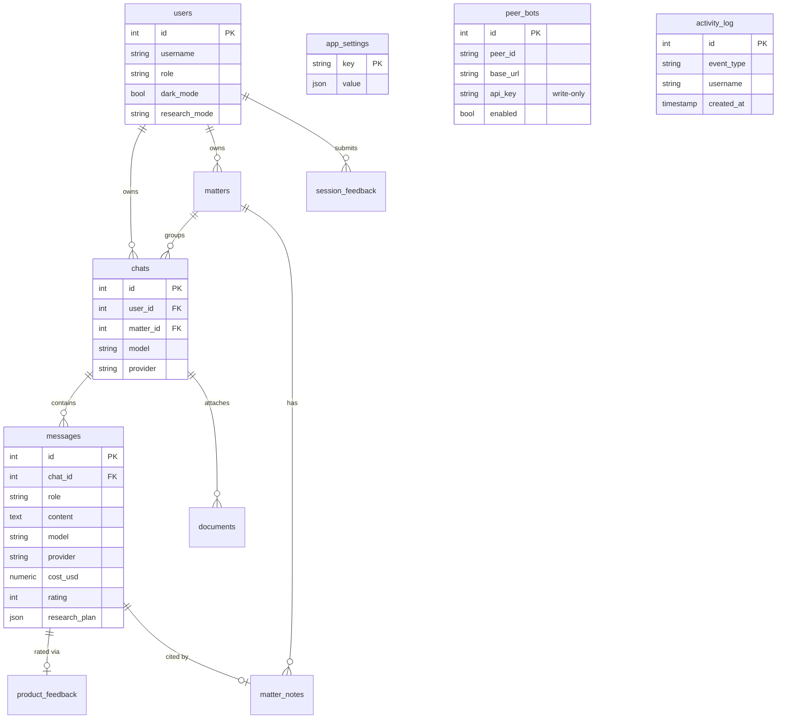

- **Parliament FTS / video tables** (Holyrood bot DB): `sp_committee_items` and `sp_plenary_items`
  (one row per agenda item, GIN FTS on `full_text`, keyed `(meeting_id, iob_id)`);
  `sp_video_captions` (one row per SP TV event, cached `transcript` + `offset_index`).
- **`request_timings`** — one row per request: latency phases, token/cost counts, tool and phase
  counters, `chat_mode`, `research_mode`, `model`, cache metrics (`cached_prompt_tokens`,
  `cache_discount_usd`, `memo_hits`, `local_cache_hits`, `local_cache_chars_saved`), efficiency
  counters (`search_budget_blocked`, `report_reformat_retries`) and `source` (`app` / `eval`).
- **`local_prompt_cache`** — the cross-user summary cache (§8): content+query hash, summary,
  `hit_count`, `last_hit_at`; sampled prune above 20K rows, 365-day retention for hit rows.
- **Other tables**: `documents` (uploaded file text), `product_feedback` (per-answer rating),
  `session_feedback` (end-of-session survey), `service_health_logs`, `matters` / `matter_notes`.
- **Runtime config vs provenance** — `app_settings` holds runtime provider config and feature flags
  (DB overrides `.env` at request time). `chats.model/provider` record the selection at chat
  creation; `messages.model/provider` record what was *actually* used at inference time
  (authoritative provenance).
- **Activity Log is mostly synthesised** — only `LOGIN` rows are written to `activity_log`; `QUERY`,
  `FEEDBACK`, `SURVEY` and `ERROR` events are derived at query time by UNION ALL over `messages`,
  `product_feedback` and `service_health_logs`, with filters applied inside each branch so `limit`
  reflects the filtered set.

---

## 12. Measurement & observability

Two audiences: operators watching a live bot (Admin Portal) and the external eval harness.

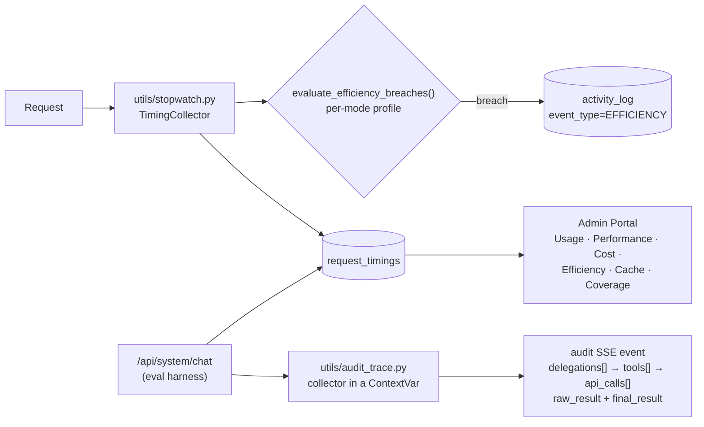

- **Per-bot efficiency profiles** — the same code grades each bot against different baselines,
  selected by `research_mode`. Fan-out denominator differs by mode (legislation: retrievals per kept
  source; parliamentary/Westminster: retrievals per distinct transcript/debate) and is
  allowlist-validated before it is interpolated into SQL. Parliamentary and Westminster band values
  are **unmeasured starting points**; the `reformat` band is unmeasured on every profile.
- **Prompt-adherence measurement** — `report_reformat_retries` + `model` answer "how often does this
  model ignore the OUTPUT STRUCTURE rules", surfaced as a rate and a per-model table. Per-model is
  the point: a rate high across all models indicts the prompt, one concentrated in a single model is
  a model-selection question. Indicator only, no breach rule (the retry is fail-soft).
- **Audit trace** — a structured trace emitted once before `result`, replacing the harness's
  reconstruction of a UI-shaped stream (which matched on *display labels* and was already silently
  broken for Deep Research). Nesting comes from the call graph, not event order: delegations open in
  `run_worker_agent`, tool records in `run_worker_tool` (handed their delegation explicitly, so
  nesting survives future parallelism), API calls by sniffing `on_chunk` inside the tool's scope.
  `raw_result` alongside `final_result` is the analytical addition — it separates a bad retrieval
  from a bad summary. Off unless requested, and every collector method swallows its own errors.
- **Eval traffic is tagged, not filtered** — `request_timings.source` separates `app` from `eval`,
  but the dashboards do not filter on it yet, so a large sweep moves the headline numbers. Eval runs
  write no EFFICIENCY breach rows.
- Spec: [api/AUDIT_TRACE.md](api/AUDIT_TRACE.md); plans:
  [planning/EFFICIENCY_PER_BOT_PLAN.md](planning/EFFICIENCY_PER_BOT_PLAN.md),
  [planning/PER_REQUEST_EFFICIENCY_PROFILE_PLAN.md](planning/PER_REQUEST_EFFICIENCY_PROFILE_PLAN.md).

---

## 13. Backup & scoped restore

Nightly `pg_dump -Fc` per database, plus a Developer-tab restore that is the inverse of the Danger
Zone: it puts back one scope at a time rather than restoring a whole server.

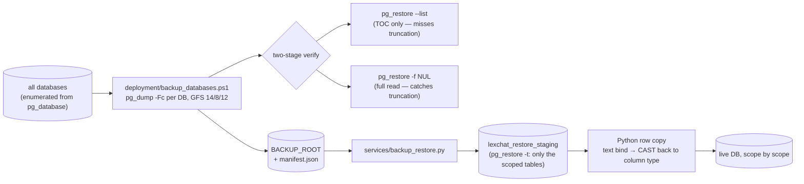

- **`--list` is not the check that works.** In a custom-format archive the TOC precedes the data, so
  a dump truncated to half its length still lists every entry and exits 0. `pg_restore -f NUL` (a
  full read) is what catches truncation. Both stages run in the backup script and on restore.
- **Never restore over live tables.** Staging is a database the app never connects to, and only the
  tables the selected scopes need are staged (0.13s vs 33s for the whole parliament dump; the SP
  corpus is never copied).
- **The copy is Python, not SQL** — `postgres_fdw`/`dblink` need `CREATE EXTENSION` and `lexuser` is
  `NOSUPERUSER`. Values cross as text and are cast back, which requires
  `CAST(CAST(:p AS text) AS <type>)` — asyncpg types a bind parameter from its surrounding cast, so
  a single cast makes it reject the text being sent deliberately.
- **`feedback` is the scope that silently does nothing if you get it wrong** — clearing feedback
  nulls `messages.rating` in place, so the rows survive and an `INSERT … ON CONFLICT DO NOTHING`
  restores nothing while reporting success. That component is an `UPDATE`. Restoring `chats` *and*
  `feedback` together masks the bug.
- Restore order is `list(reversed(_CLEAR_ORDER))`, asserted at import; sequences are `setval`'d
  afterwards; `matter_notes.message_id` links are repaired as part of the `chats` scope.
- **The `cache` scope can never be restored** — `local_prompt_cache` rows are excluded from every
  dump by design, and that is reported as unavailable with the reason. Not a bug.
- **`BACKUP_ROOT` must match the scheduled task's `-BackupRoot`**, or the Developer tab reads an
  empty directory while backups run fine elsewhere. Both default to `C:\LexChatBackups`.
- Design: [BACKUP_RESTORE_PLAN.md](BACKUP_RESTORE_PLAN.md); procedure:
  [deployment/BACKUP_RUNBOOK.md](deployment/BACKUP_RUNBOOK.md).

---

## 14. Deployment view

Native Windows Server 2022 — **no Docker, no WSL, no nginx.** One uvicorn process per bot is the
entire web tier; PostgreSQL runs as a Windows service; Ollama runs locally only when it is the
active provider.

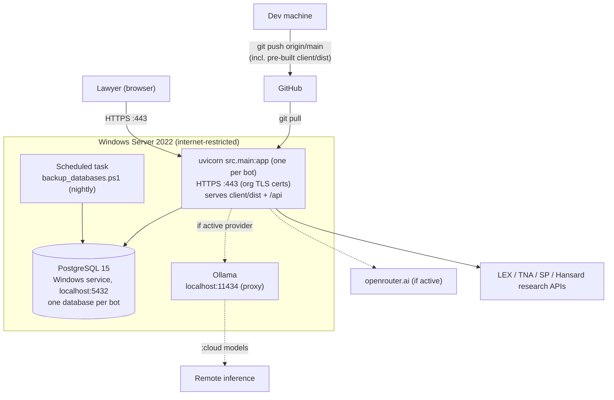

**Lifecycle**
- **Start/stop** — `deployment/start_native.cmd` (PostgreSQL → Ollama → uvicorn) and
  `deployment/stop_native.cmd`. Note `start_native.cmd` copies `.env.native` over `.env` on every
  start, so `.env.native` is the *live* target config and must not carry tracked per-machine edits.
- **Updates** — the *only* deployment path is `git pull` from `origin/main`. The frontend is
  pre-built on the dev machine and committed (`client/dist/`, force-added); the target needs no
  Node.js. See [deployment/NATIVE_DEPLOYMENT.md](deployment/NATIVE_DEPLOYMENT.md).
- **Backups** — `deployment/install_backup_task.ps1` registers the nightly task (needs elevation).
  Off-box copy of the dumps is still outstanding.
- **Local dev** — HTTP on port 8000 (no TLS certs locally); multiple bots via
  `deployment/start_federation_dev.ps1` per [deployment/LOCAL_SETUP.md](deployment/LOCAL_SETUP.md).

---

## Cross-references

| Concern | Document |
|---|---|
| Product spec, features, agent narrative | [SPECIFICATION.md](SPECIFICATION.md) |
| Schema & low-level flow | [DESIGN.md](DESIGN.md) |
| REST/SSE endpoint reference | [api/ServerAPISpec.md](api/ServerAPISpec.md) |
| Eval endpoint + audit trace | [api/AUDIT_TRACE.md](api/AUDIT_TRACE.md) |
| External LEX API | [api/LexAPISpec.md](api/LexAPISpec.md) |
| Firewall / allowlist / ports | [NETWORK_AND_DEPENDENCIES.md](NETWORK_AND_DEPENDENCIES.md) |
| Deployment (target + local) + backup runbook | [deployment/](deployment/) |
| Deep Research build spec | [deep-research/IMPLEMENTATION_PLAN.md](deep-research/IMPLEMENTATION_PLAN.md) |
| Caching stack design | [LOCAL_PROMPT_CACHE_PLAN.md](LOCAL_PROMPT_CACHE_PLAN.md), [CACHE_REVIEW_FIXES_PLAN.md](CACHE_REVIEW_FIXES_PLAN.md) |
| Backup & scoped restore design | [BACKUP_RESTORE_PLAN.md](BACKUP_RESTORE_PLAN.md) |
| Holyrood data model | [parliament/PARLIAMENTARY_DATA.md](parliament/PARLIAMENTARY_DATA.md) |
| Drafting bot (in build, off `main`) | [drafting/BUILD_PLAN.md](drafting/BUILD_PLAN.md) |
| Deferred run durability | [CONCURRENT_RUNS_DURABILITY.md](CONCURRENT_RUNS_DURABILITY.md) |
| Frontend design tokens | [frontend/design-system.md](frontend/design-system.md) |
| Canonical todo list | [TODO.md](TODO.md) |
| Agent/contributor context (canonical) | `../CLAUDE.md` |
