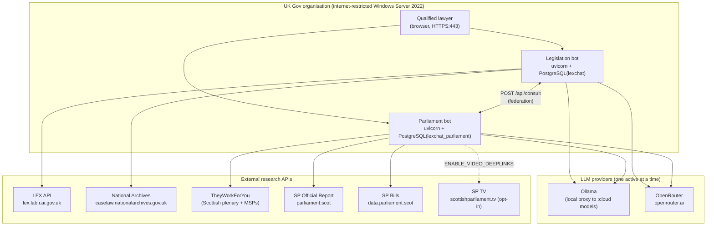
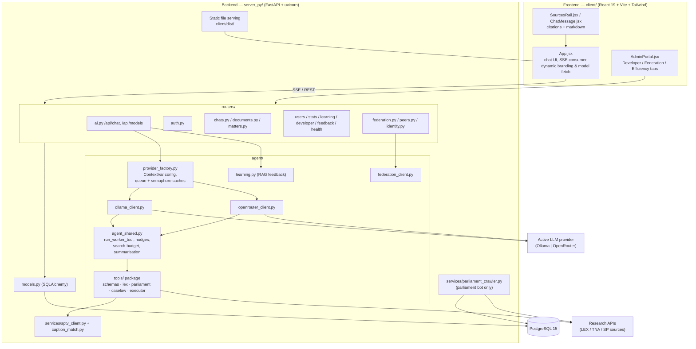
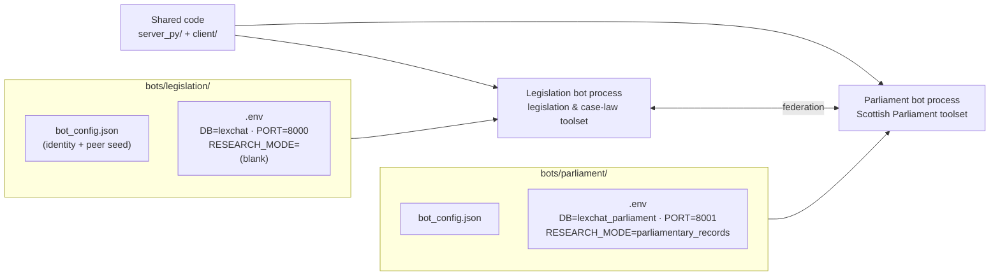
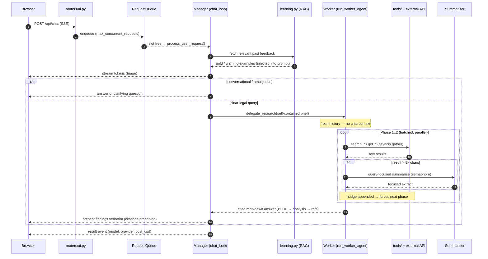
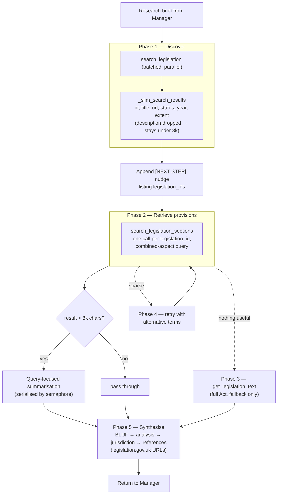
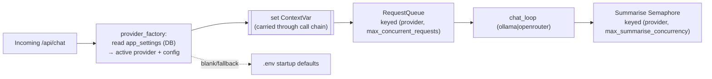
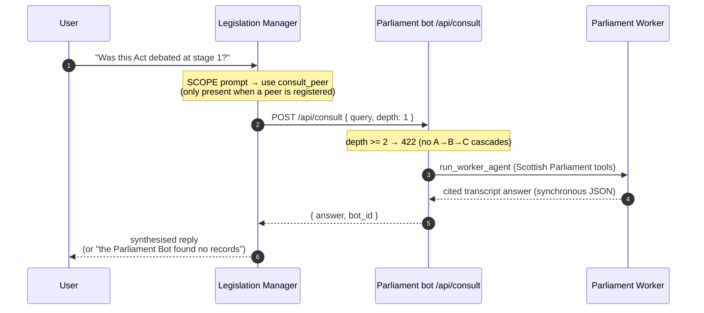
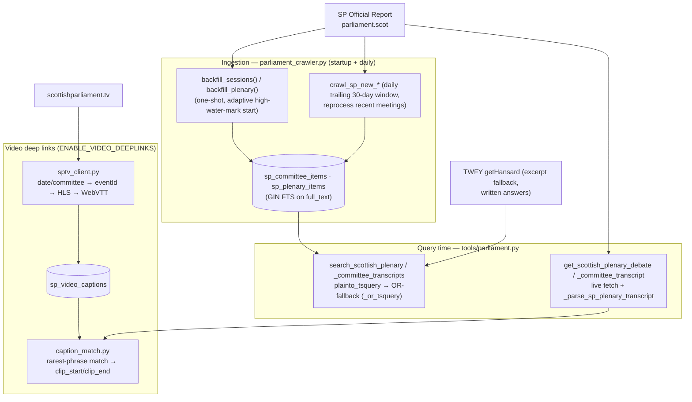
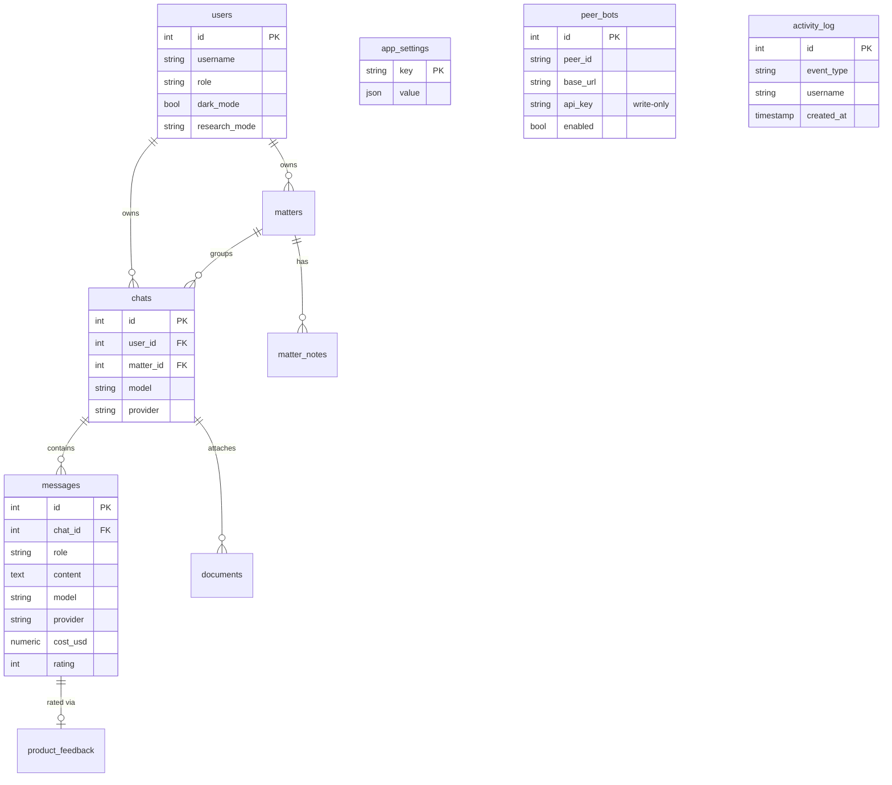
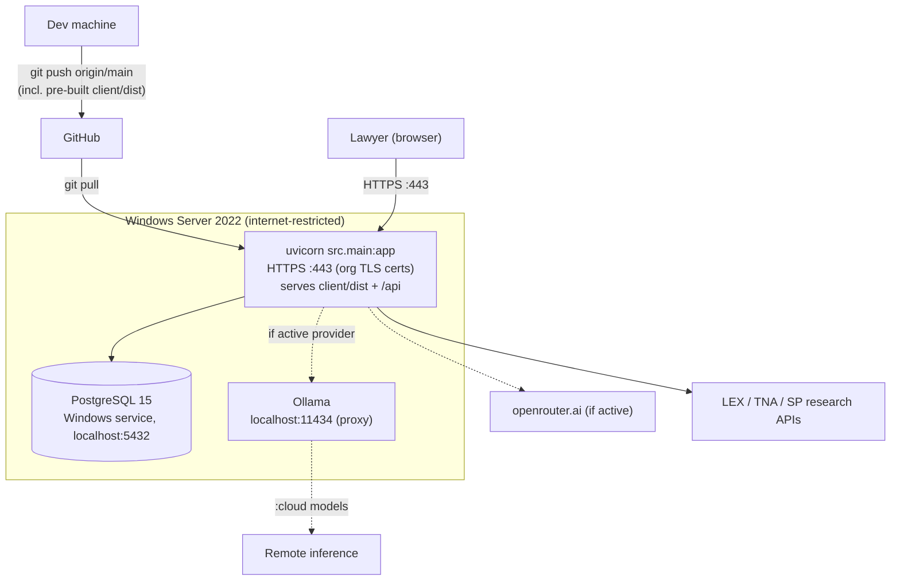

# AILA — Architecture Reference

AILA (product name for the codebase historically called *LexChat*) is an AI legal-research
assistant for a UK government organisation. This document is the architectural reference: it
presents the system through a series of complementary **views**, each with a Mermaid diagram.

For narrative product detail see [SPECIFICATION.md](SPECIFICATION.md); for low-level schema/flow
detail see [DESIGN.md](DESIGN.md); for the authoritative endpoint list see
[api/ServerAPISpec.md](api/ServerAPISpec.md); for firewall/allowlist detail see
[NETWORK_AND_DEPENDENCIES.md](NETWORK_AND_DEPENDENCIES.md).

> **Guiding principle: one codebase, many bots.** There is a single backend (`server_py/`) and a
> single frontend (`client/`). Every bot — the legislation assistant, the Scottish Parliament bot,
> and any future bot — runs the *same* `uvicorn src.main:app`, differentiated by **configuration,
> not forked code**.

---

## 1. System context

Who and what the system talks to. The organisation runs one or more **bot processes**; each serves
qualified-lawyer users and reaches out to LLM providers and research APIs. Bots can consult each
other via federation.

**Notes**
- The target is *internet-restricted* (whitelist-only outbound), not air-gapped. Each external host
  above must be whitelisted for the corresponding bot — see [NETWORK_AND_DEPENDENCIES.md](NETWORK_AND_DEPENDENCIES.md).
- The parliament bot is **Scotland-only** (Holyrood). Westminster/Hansard sources were removed.

---

## 2. Container / component view (a single bot process)

One uvicorn process serves both the pre-built React UI (static files) and the `/api` backend. The
agent pipeline is provider-agnostic: a `ContextVar` carries the resolved provider config through the
whole async call chain.

**Key design points**
- **Provider abstraction** — `ollama_client.py` and `openrouter_client.py` each implement the same
  ReAct `chat_loop`; `agent_shared.py` holds the shared tool-execution + summarisation pipeline. The
  active provider is resolved per request from the `app_settings` table and carried by a `ContextVar`
  — no function signatures change when the provider switches.
- **Per-provider concurrency** — a `RequestQueue` (`max_concurrent_requests`) and a summarisation
  `asyncio.Semaphore` (`max_summarise_concurrency`) are cached per `(provider, concurrency)` and
  recreated automatically when settings change.
- **No global auth middleware** — every protected route declares `Depends(get_current_user)`
  explicitly. Public routes: `/api/auth/login`, `/api/health`, and the identity endpoints.

---

## 3. One codebase, many bots

Behaviour is switched at runtime by configuration under `bots/<id>/`, not by branching code.

`RESEARCH_MODE` (env) → `research_mode` drives two things:
`tools/schemas.py::get_worker_tools(mode)` selects the Worker toolset, and the matching system
prompt is chosen. Modes: `legislation_only`, `case_law_only`, `legislation_and_case_law`,
`parliamentary_records`. Each bot is an independent process with its **own database and port**.

---

## 4. Request lifecycle — Manager / Worker (sequence)

The Manager handles conversation and delegates deep research to the Worker. The Manager streams
tokens to the browser over SSE; the Worker's intermediate reasoning is not streamed.

Turn caps prevent runaway recursion (`chat_loop` capped at ~20 turns). Tool results are hard-capped
to `summarise_threshold + 4,000` chars after summarisation to protect the context window.

---

## 5. Worker research pipeline (legislation mode)

The Worker follows a prescribed multi-phase process. Discovery is deliberately slimmed and batched
so that Phase 1 rarely needs summarisation; Phase 2 does the real retrieval.

The **parliament** flow is analogous — *discover → retrieve verbatim transcript → synthesise* — but
adds a hard **search budget** (3 discovery calls) enforced in `run_worker_tool`: once exhausted, the
tool returns a hard-stop message forcing the model into retrieval.

---

## 6. Provider resolution & concurrency

- `AppSetting(key="provider.ollama")` and `AppSetting(key="provider.openrouter")` store per-provider
  JSON blobs (`base_url`, `api_key`, `model`, `summarisation_model`, `temperature`, concurrency).
- A separate `summarisation_model` can be configured per provider so a fast/cheap model handles
  document summarisation while a capable model does reasoning.
- Ollama summarisation concurrency should be **1** (concurrent calls to the cloud endpoint 500);
  OpenRouter tolerates 5+.

---

## 7. Federation

When at least one enabled peer is registered, the Manager gains a `consult_peer` tool alongside
`delegate_research`. With zero peers the behaviour is identical to a single-bot deployment (the tool
is simply absent).

- Peer registry lives in the `peer_bots` table (Admin Portal → Federation tab). `api_key` is
  **write-only** — never returned by any response.
- `/api/consult` is **synchronous JSON**, not SSE — the calling Manager blocks for the full answer.

---

## 8. Parliament data pipeline (parliament bot only)

Scottish Parliament transcripts are crawled into local Postgres FTS tables and retrieved verbatim on
demand. Video deep links are an opt-in enrichment layer.

- **FTS, not embeddings** — a measured go/no-go gate found FTS-only sufficient (semantic retrieval is
  deferred/NO-GO). Two cheap wins shipped instead: an **OR-fallback** when `plainto_tsquery` (all
  terms AND-ed) returns zero rows, and **prompt-level query wording** (use the official Holyrood term,
  e.g. *unhoused → homeless*).
- **Incremental crawl** — the source sends no `Last-Modified`/`ETag`, so change detection is driven
  by our own stored state: adaptive backfill start + a trailing-window daily re-scan.
- **Video timing** — segment ordinal × 6s using the *true* HLS playlist index (not caption-stream
  MPEGTS transitions), Europe/London DST-correct. Fully fail-soft: any failure just omits the link.

---

## 9. Data model (core entities)

Selected tables from `server_py/src/models.py`. FTS/crawler tables and `request_timings` are shown
separately for clarity.

**Parliament FTS / video tables** (parliament bot DB): `sp_committee_items` and `sp_plenary_items`
(one row per agenda item, GIN FTS on `full_text`, keyed `(meeting_id, iob_id)`); `sp_video_captions`
(one row per SP TV event, cached `transcript` + `offset_index`, unique `event_id`).

**Runtime config vs provenance** — `app_settings` holds runtime provider config (DB overrides `.env`
at request time). `chats.model/provider` record the selection at chat creation; `messages.model/
provider` record what was *actually* used at inference time (authoritative provenance).

---

## 10. Deployment view

Native Windows Server 2022 — **no Docker, no WSL, no nginx.** One uvicorn process is the entire
web tier; PostgreSQL runs as a Windows service; Ollama runs locally only when it is the active
provider.

**Lifecycle**
- **Start/stop** — `deployment/start_native.cmd` (PostgreSQL → Ollama → uvicorn) and
  `deployment/stop_native.cmd`.
- **Updates** — the *only* deployment path is `git pull` from `origin/main`. The frontend is
  pre-built on the dev machine and committed (`client/dist/`, force-added); the target needs no
  Node.js. See [deployment/NATIVE_DEPLOYMENT.md](deployment/NATIVE_DEPLOYMENT.md).
- **Local dev** — HTTP on port 8000 (no TLS certs locally); multiple bots per
  [deployment/LOCAL_SETUP.md](deployment/LOCAL_SETUP.md).

---

## Cross-references

| Concern | Document |
|---|---|
| Product spec, features, agent narrative | [SPECIFICATION.md](SPECIFICATION.md) |
| Schema & low-level flow | [DESIGN.md](DESIGN.md) |
| REST/SSE endpoint reference | [api/ServerAPISpec.md](api/ServerAPISpec.md) |
| External LEX API | [api/LexAPISpec.md](api/LexAPISpec.md) |
| Firewall / allowlist / ports | [NETWORK_AND_DEPENDENCIES.md](NETWORK_AND_DEPENDENCIES.md) |
| Deployment (target + local) | [deployment/](deployment/) |
| Parliament data model | [parliament/PARLIAMENTARY_DATA.md](parliament/PARLIAMENTARY_DATA.md) |
| Frontend design tokens | [frontend/design-system.md](frontend/design-system.md) |
| Agent/contributor context (canonical) | `../CLAUDE.md` |
